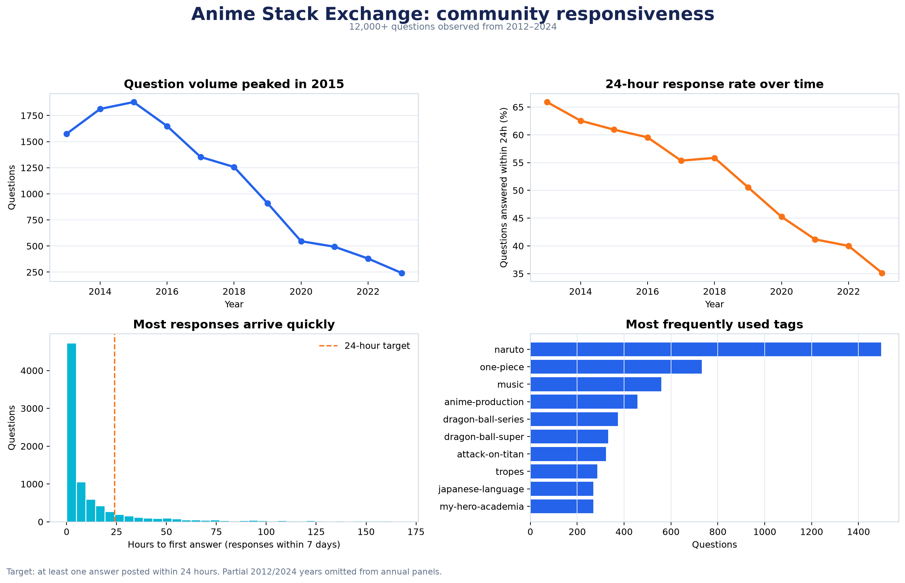
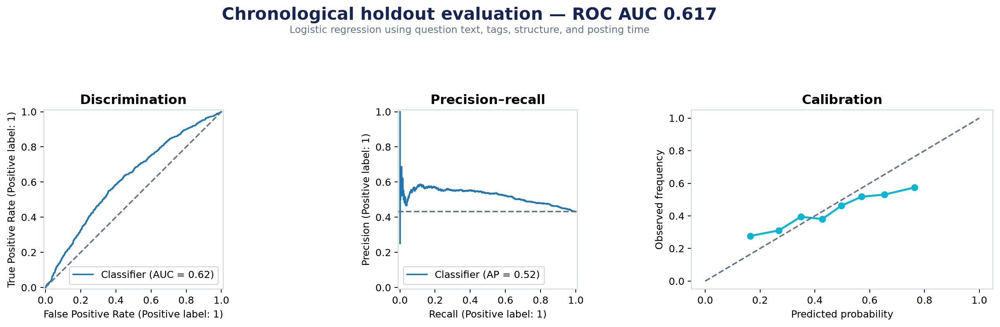

# Anime StackViz

### Predicting whether an Anime & Manga Stack Exchange question will receive an answer within 24 hours



Anime StackViz is an end-to-end data-science study of community responsiveness on Anime & Manga
Stack Exchange. It began as a university exploratory-analysis assignment and was rebuilt as a
reproducible portfolio project with a testable research question, leakage-aware feature engineering,
chronological validation, interpretable modelling, automated tests, and a documented data lineage.

## Headline findings

The study contains **12,373 eligible questions** posted between December 2012 and March 2024.

| Finding | Result |
|---|---:|
| Questions receiving an answer within 24 hours | **57.4%** |
| Median time to first answer among answered questions | **8.23 hours** |
| 24-hour response rate, 2013 | **65.9%** |
| 24-hour response rate, 2023 | **35.1%** |
| Full-model ROC AUC on the newest 20% of questions | **0.617** |
| Full-model average precision | **0.522** |
| Test-set positive prevalence | **0.431** |

The central descriptive finding is a long-term decline in both question volume and rapid-response
rate. The predictive result is intentionally modest: question content and tag identity improve
ranking performance over a metadata-only model (ROC AUC **0.563 → 0.617**), but they do not remove
the temporal drift between the early and later community. This is evidence that changes in community
capacity matter beyond the wording of an individual question; it is an association, not a causal claim.



## Research design

### Target

`answered_within_24h = 1` when at least one answer was posted during the 24 hours after a question's
creation. Questions posted less than 24 hours before the dump's final timestamp are excluded.

The target is **not** “accepted within 24 hours.” The dump records which answer was ultimately
accepted, but not the time at which acceptance occurred. Using first-answer timestamps avoids
inventing an unobservable outcome.

### Features available at question time

- TF–IDF features from the title and body
- Tag identity and tag count
- Title and body length
- Question-mark, code-block, and link counts
- Cyclical hour-of-day and weekday features
- Posting year

Final score, view count, answer count, accepted-answer ID, and current user reputation are excluded
because they are measured after the question is created or are otherwise vulnerable to leakage.

### Evaluation

The oldest 80% of questions train the model and the newest 20% form a untouched chronological test
set. This is more realistic than a random split and exposes genuine distribution shift:

- Training period ends: **25 February 2019**
- Test period: **26 February 2019 – 27 March 2024**
- Training response rate: **60.9%**
- Test response rate: **43.1%**

Three benchmarks are reported:

| Model | ROC AUC | Average precision | Brier score |
|---|---:|---:|---:|
| Prevalence baseline | 0.500 | 0.431 | 0.277 |
| Metadata logistic regression | 0.563 | 0.480 | 0.246 |
| Text + tags + metadata logistic regression | **0.617** | **0.522** | **0.245** |

The model is useful for studying relative response likelihood, not for automated moderation or
high-stakes decisions. Calibration degrades at the extremes, so raw probabilities should not be
treated as operational forecasts without recalibration on newer data.

## Reproducibility

Python 3.11 or newer is required.

```bash
git clone https://github.com/M1hawk005/Anime-StackViz.git
cd Anime-StackViz

python -m venv .venv
# Windows: .venv\Scripts\activate
# macOS/Linux: source .venv/bin/activate

python -m pip install -e ".[dev]"
```

Download the Anime & Manga archive from the
[Stack Exchange Data Dump](https://archive.org/details/stackexchange), extract the XML files into
`data/raw/`, and run:

```bash
# Stream raw XML files to CSV and generate a checksum manifest
anime-stackviz prepare --data-dir data

# Build the question cohort, train/evaluate models, and render the report
anime-stackviz analyse --data-dir data --report-dir reports
```

If processed CSV files already exist, only the `analyse` command is needed. Generated row-level
predictions remain ignored by Git; aggregate audit files, metrics, and figures are versioned.

## Repository layout

```text
.
├── data/                       # raw/processed data (ignored) and data documentation
├── notebooks/                  # original assignment retained as a legacy artifact
├── reports/
│   ├── data_audit.json         # cohort and data-quality facts
│   ├── metrics.json            # chronological model evaluation
│   ├── top_features.json       # largest model coefficients
│   └── figures/                # publication-ready charts
├── src/anime_stackviz/
│   ├── data.py                 # streaming XML conversion and loading
│   ├── features.py             # target construction and leakage-safe features
│   ├── model.py                # baselines, modelling, and evaluation
│   ├── report.py               # visual reporting
│   └── cli.py                  # end-to-end command line interface
├── tests/                      # synthetic unit tests; no dump required
├── pyproject.toml              # minimal runtime and development dependencies
└── .github/workflows/ci.yml    # lint and test automation
```

## Verification

```bash
ruff check src tests
pytest
```

The test suite checks tag parsing, HTML cleaning, first-answer target construction, the 24-hour
boundary, and exclusion of incomplete observation windows. CI runs the same checks on every push and
pull request.

## Limitations

- The dump ends in March 2024; 2012 and 2024 are partial years and are omitted from annual comparisons.
- Deleted posts are absent from the public dump, which may introduce survivorship bias.
- All timestamps are interpreted as UTC; no claims are made about users' local daily routines.
- The analysis observes association, not the causal effect of writing style or tag choice.
- Tags and language evolve, creating distribution shift that a static vocabulary cannot fully absorb.
- The model uses no user-profile variables to reduce leakage and privacy risk.
- A single community may not generalize to other Stack Exchange sites.

## Ethics and attribution

Only aggregate results are presented. The rebuilt report intentionally removes user leaderboards and
free-text location inference from the original assignment because they add privacy risk without
strengthening the research question. See [`data/README.md`](data/README.md) for source, storage, and
attribution guidance.

## Original assignment

The original notebook is preserved in [`notebooks/Anime StackViz.ipynb`](notebooks/Anime%20StackViz.ipynb)
for provenance. It is labelled as a legacy artifact because several early exploratory claims were
superseded by the tested pipeline in `src/anime_stackviz/`.
